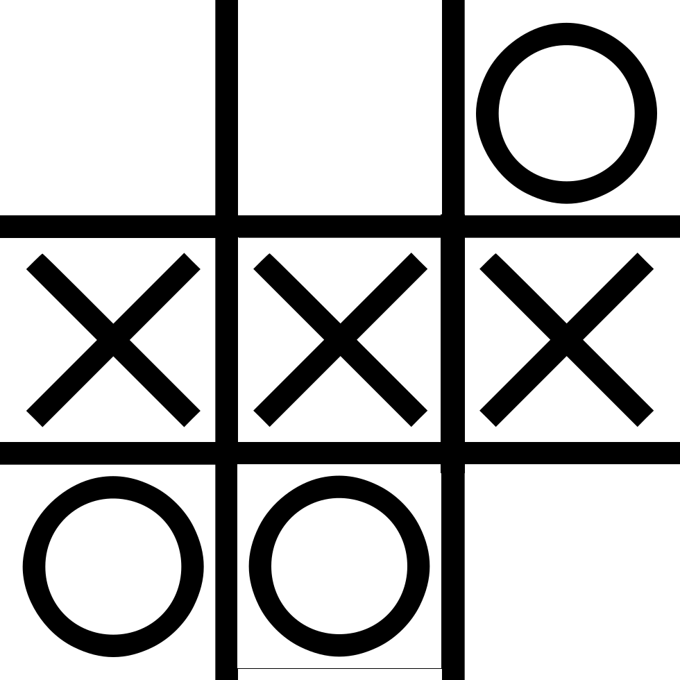
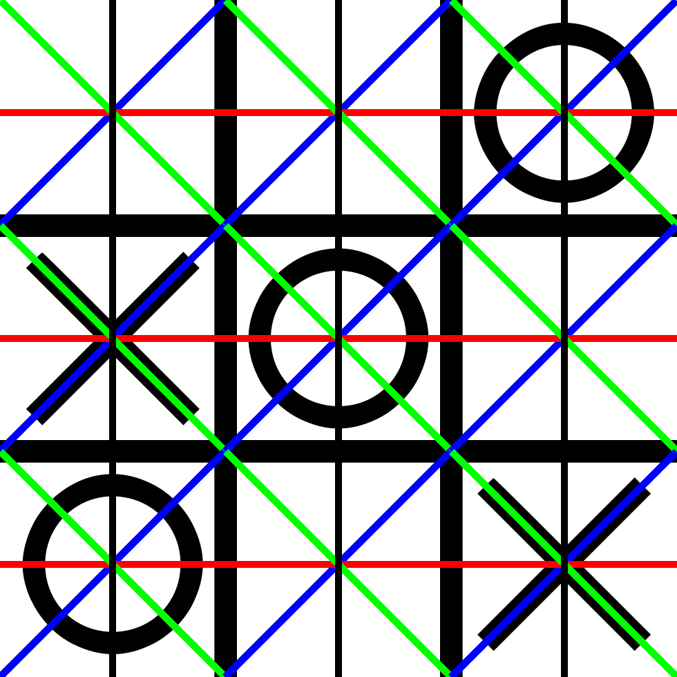
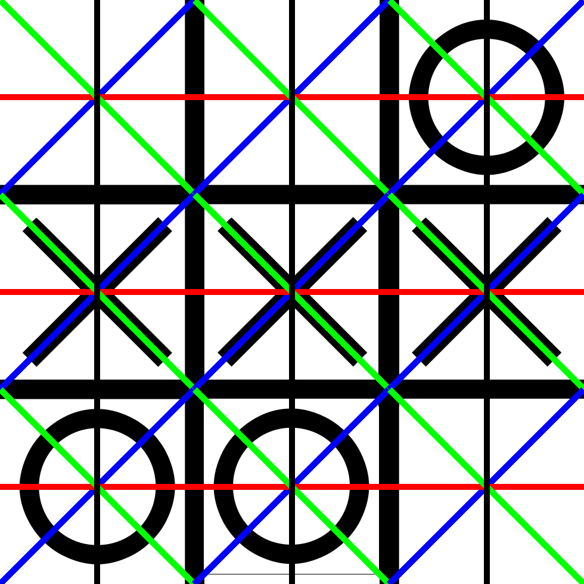
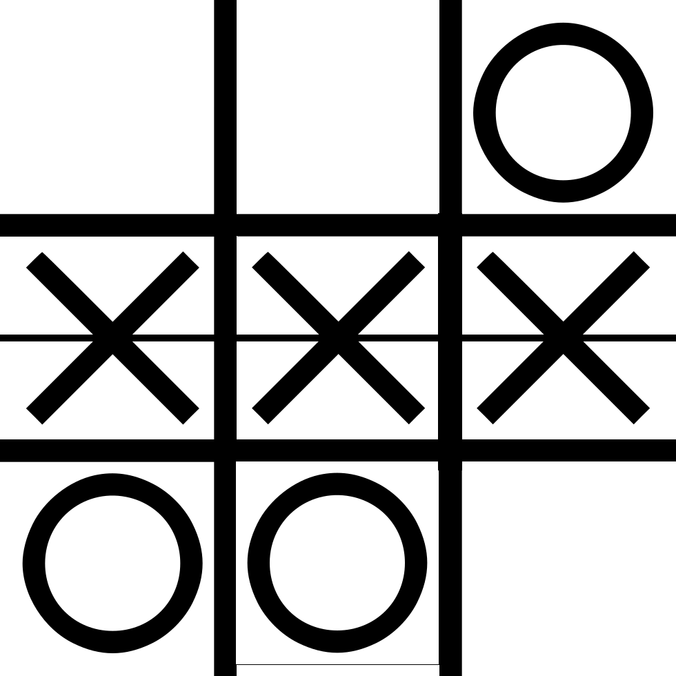

# Крестики-Нолики

Установка:

```
pip3 install -r requirements.txt
```

Запуск:

```
python3 main.py tictactoe.png result.png 
```

Примеры исходных файлов:

Example 1 | Example 2
--- | ---
 | 

Чтобы определить количество пересечений, я провожу такую сетку:

Grid 1 | Grid 2
--- | ---
 | 

Результат получился вот такой:

Result 1 | Result 2
--- | ---
 | 
